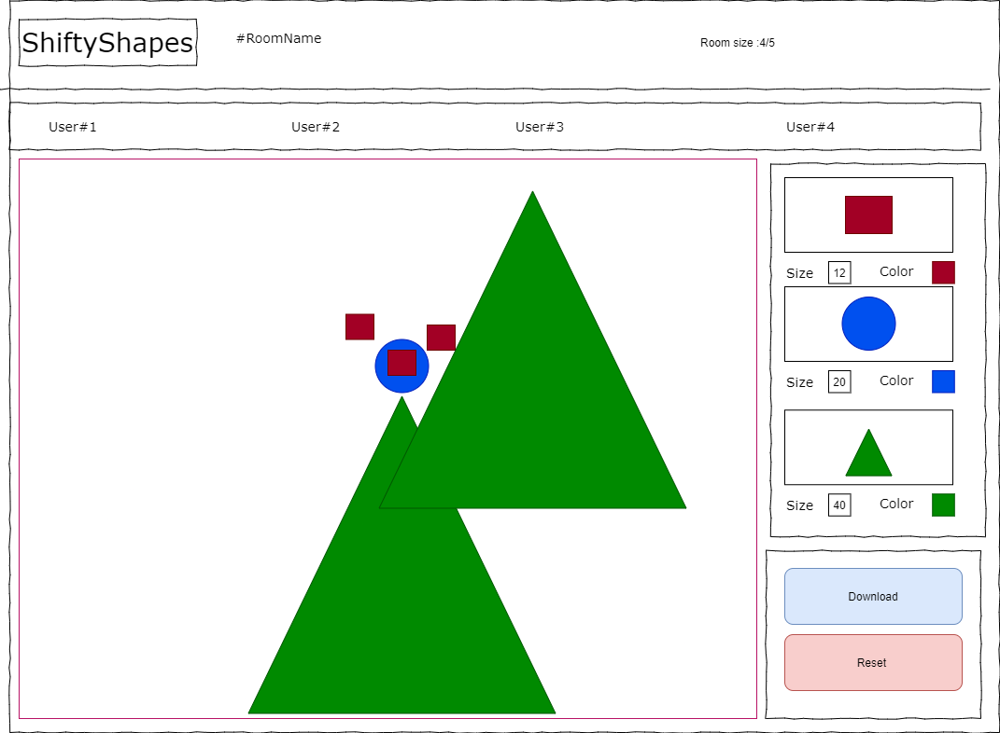
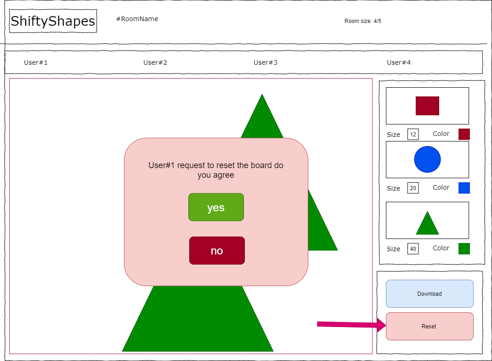
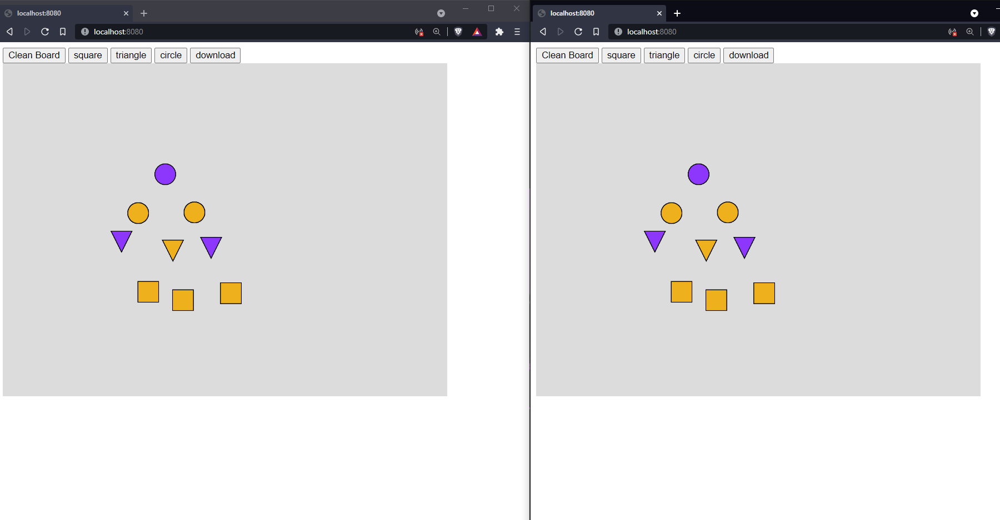

# ShiftyShapes
ARSW 2021-i Project
Escuela Colombiana de Ingeniería Julio Garavito 
## _Author: Lorenzo Marquez Pinto_

#Spring 1

## Summary

The objective of this project is to create a room in real time where different geometric figures can be interacted with on a board shared with the members of the room.

- Allow the client to give himself a name before entering the room.
- Allow the client to download the content of the board at any moment as a png(Possible modifications)
- Add notification when users join the room
- Add notification when users leave the room
- Allow the client to create a room with defined capacity or join one already created (Possible modifications)
- Allow clients to compose drawings based on basic geometric figures on the shared board of the room
- Allow the superposition of drawings of a client with respect to those of another client with the figures.
- Allow to delete the shared board with a vote of the members of the room.
- Allow the modification of the size and color of the figure before it is located

## Problem to solve
This drawing room allows real-time interaction between different clients through a shared board in the room in which different figures or drawings can be made based on geometric compositions given in the room. The figures can be decided by the user by selecting it with the mouse, what size it will give it, the color it will have and once the above is selected, the user will place the figure on the board and can repeat the process.
This allows the composition of different drawings based on geometric figures with the collaboration of different people or individually, in addition it is considered that this space covers in a different way than the common ones to make compositions because you only have limited geometric figures at your disposal and the possible intervention or collaboration of another person while the composition is being made.

# User history

### #1 Compose figures

**As**  ShiftyShapes user
**I want** to be able to interact with the geometric figures to place them on the board
**so that** you can make compositions based on geometric figures

>criteria of acceptance:
>- The geometric figure that is located on the board is visible to other users in the room
>- The selected geometric figure is located where the click is made within the board

### #2 Reset board

**As** ShiftyShapes user
**I want** to be able to request a reset of the board content by selecting the button
**so that** the board is cleaned of the figures it currently has and the composition is started again from scratch.

> acceptance criteria:
> - When selecting the reset button, a voting box appears
> - The board reset only if the majority is in favor
> - Be notified if the board is going to be deleted or not before it happens
> - That other users get the option to vote even if they were not the ones who requested it
> - That there is a time limit for voting and that if the time for voting is over and there is no vote, it is counted as a negative vote
### #3 Shape Color
**As** ShiftyShapes user
**I want** to be able to choose the color of the shape im gonna select 
**so that** i can see the color of my preference in the shape im using to compouse the figure in the board
> acceptance criteria:
> - Select the color before put the shape in the board
> - The color of the shape must match the color selected

### #4 Shape size
**As** ShiftyShapes user
**I want** to be able to choose the size of the shape im gonna select 
**so that** i can see the size of my preference in the shape im using to compouse the figure in the board
> acceptance criteria:
> - Select the size before put the shape in the board
> - The size of the shape must mtach the size selected

### #5 Download Board Content
**As** ShiftyShapes user
**I want** to be able to download the current content of the board as an image
**so that** i save the work done and see it in a future ocation
> acceptance criteria:
> - Let me choose the folder where i want to save the file
> - Save the file in format .png

### #6 New to the room
**As** ShiftyShapes user
**I want** to be able to see the current progress in the room even if i just join in the room
**so that**  the shapes i put in the board make sense with the current progress of the room
> acceptance criteria:
> - Be able to see the progress of the board made before the user join the room
> - Be able to put shapes in the board that updates in the board of the room

### #7 User List
**As** ShiftyShapes user
**I want** to be able to see the current users in the room
**so that**  i am aware of how many people im working with
> acceptance criteria:
> - Somewhere in the room must show the limit size of the room and how many people are in the room at the moment.
> - Somewhere in the room must show the name of the users in the room
### #8 User name
**As** ShiftyShapes user
**I want** to be able type the name im gonna use before i join a room
**so that**  i can be identify by other users in the room
> acceptance criteria:
> - Somewhere in the room it must display the username selected

#Spring 2

Using as a base the whiteboard developed in class previously, modifications were made so that there are a variety of figures and that these figures will not be drawn constantly by click but in a unique way and see the need to select a new figure.
At the moment it goes locally and takes into account the different sessions as in the board developed previously.

