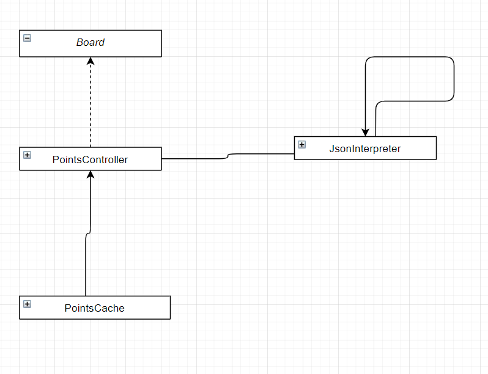
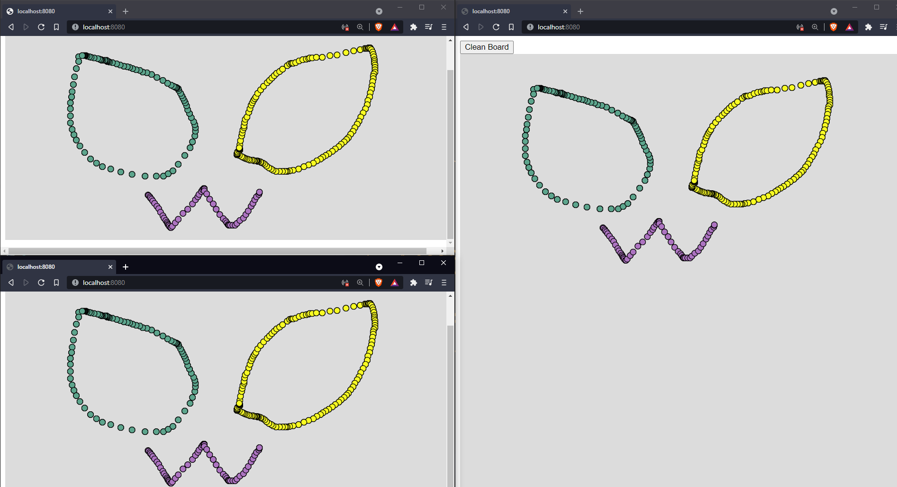
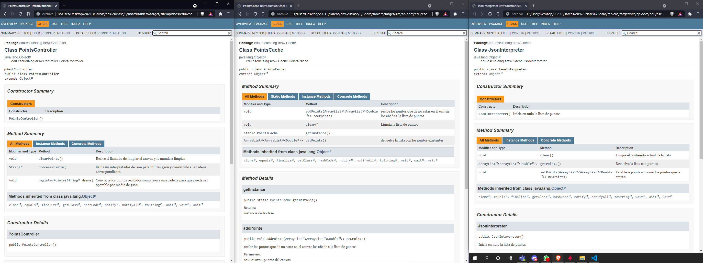

# Tarea #6
>## Autor
>>Lorenzo Maruqez
>## Fecha
>>28/06/2021
>## LOC/h
>> 200 Lineas, 11LOC/h 

# Pre-Requisitos
> - Tener java 1.8 
> - conocimiento del uso de consola
> - conocimiento del uso de mvn

# Diagrama
>
# WhiteBoard
En este ejercicio se modifico el tablero realizado en clase para que pueda resivir la interaccion de diferentes usuarios de manera notable y que se pueda borrar el contenido de este.
>
> - Para correr el programa se usa
>  `java -cp "./target/classes" edu.escuelaing.arsw.Board`

> - Si se quiere ver implementado en Heroku puede acceder a 
> insertal link

# JavaDoc
> 

# Licencia
Este proyecto esta bajo Licencia de uso libre.